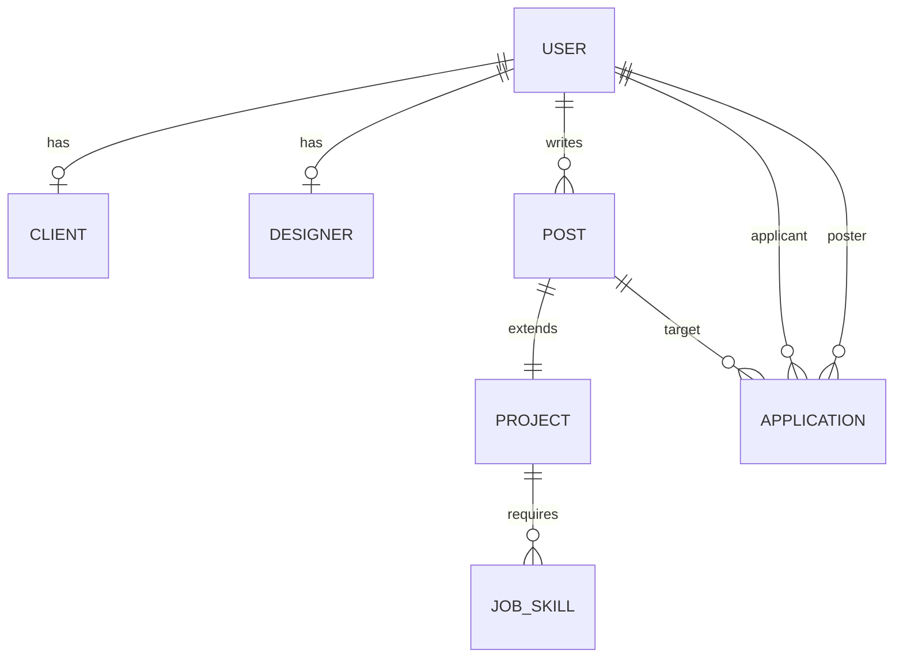
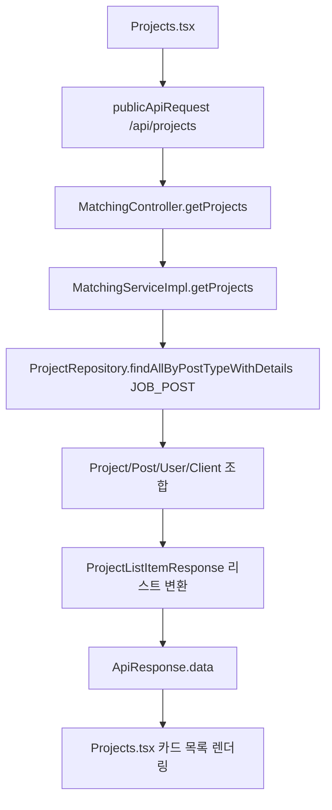
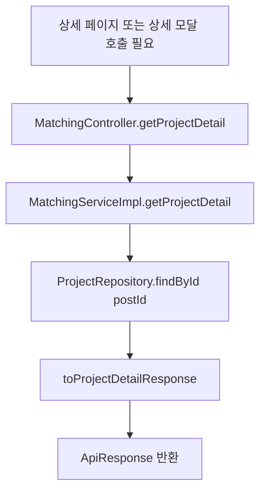
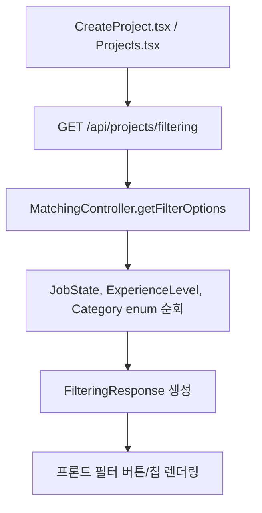

# Matching 도메인 분석 및 Controller 흐름도

## 검토 대상

- 백엔드: `src/main/java/com/example/pixel_project2/matching` 전체
- 백엔드 엔티티: `src/main/java/com/example/pixel_project2/common/entity` 전체
- 프론트 API: `frontend/src/app/api/projectApi.ts`
- 프론트 페이지: `frontend/src/app/pages/CreateProject.tsx`, `Projects.tsx`, `ProjectDetail.tsx`

참고: 요청에 적힌 `mathcing` 폴더는 실제 프로젝트에서는 `matching` 폴더로 존재한다.

## 1. 도메인 구조 요약

매칭 기능은 `Post`를 공통 게시물 루트로 사용하고, 그 위에 `Project`가 1:1로 확장되는 구조다.

- `User`
  - 공통 사용자 루트
  - `Client`, `Designer`와 각각 1:1
- `Client`
  - 프로젝트 등록 주체로 사용될 수 있는 클라이언트 정보
  - 회사명 보유
- `Post`
  - 공통 게시물 엔티티
  - `user`, `title`, `postType`, `category` 보유
- `Project`
  - `Post`와 1:1, PK 공유
  - `overview`, `fullDescription`, `deadline`, `budget`, `projectState`, `jobState`, `experienceLevel`
  - `responsibilities`, `qualifications`를 `List<String>` 형태로 보유하려는 의도
- `JobSkill`
  - `Project` N:1
  - 프로젝트 요구 스킬 저장
- `Application`
  - 프로젝트 지원 정보
  - `applicant`, `poster`, `post` 연결
  - 현재 매칭 서비스에서는 실제 저장 로직 미구현

핵심 관계는 아래와 같다.



## 2. Controller 매핑 기준 흐름

`MatchingController`의 베이스 경로는 `/api/projects`다.

### 2.1 목록 조회

- 매핑: `GET /api/projects`
- 흐름:



- 실제 사용 화면: `Projects.tsx`
- 비고:
  - 프론트는 `publicApiRequest`를 사용하므로 `ApiResponse.data`만 받는다.
  - 목록 DTO는 `id`, `nickname`, `companyName`, `category`, `title`, `overview`, `budget`, `experienceLevel`, `jobState`, `deadline` 중심이다.

### 2.2 상세 조회

- 매핑: `GET /api/projects/{postId}`
- 흐름:



- 현재 상태:
  - 백엔드 API는 존재한다.
  - `ProjectDetail.tsx`는 이 API를 호출하지 않는다.
  - `Projects.tsx`도 상세 API를 직접 호출하지 않고, 목록 데이터를 `ProjectDetailModal` 형식으로 변환해서 임시 상세를 보여준다.

### 2.3 필터 옵션 조회

- 매핑: `GET /api/projects/filtering`
- 흐름:



- 실제 사용 화면:
  - `CreateProject.tsx`
  - `Projects.tsx`

### 2.4 프로젝트 생성

- 매핑: `POST /api/projects/create`
- 인증: `@AuthenticationPrincipal AuthenticatedUser user`
- 흐름:

```mermaid
flowchart TD
    A[CreateProject.tsx] --> B[createProjectApi]
    B --> C[apiRequest POST /api/projects/create]
    C --> D[MatchingController.createProject]
    D --> E[MatchingServiceImpl.createProject userId, request]
    E --> F[UserRepository.findById]
    F --> G[Post 저장]
    G --> H[Project 저장]
    H --> I[skills 존재 시 JobSkill saveAll]
    I --> J[toProjectDetailResponse]
    J --> K[ApiResponse.data.postId]
    K --> L[navigate /projects/{postId}]
```

- 실제 사용 화면: `CreateProject.tsx`
- 중요한 점:
  - 프론트는 생성 성공 후 `/projects/${response.postId}`로 이동한다.
  - 하지만 `ProjectDetail.tsx`는 API 연동이 없어서 생성 직후에도 실제 상세 데이터가 반영되지 않는다.

### 2.5 기타 매핑

아래 엔드포인트는 Controller에는 존재하지만 현재 확인한 프론트 파일들과 연결되지 않았다.

- `POST /api/projects/{postId}/apply`
- `POST /api/projects/{postId}/close`
- `PATCH /api/projects/{postId}/edit`
- `DELETE /api/projects/{postId}/delete`
- `POST /api/projects/{postId}/inquiry`
- `GET /api/projects/{postId}/applications`

그리고 이들 대부분은 서비스 구현도 아직 더미 문자열 혹은 샘플 리스트 반환 수준이다.

## 3. 프론트-백엔드 연결 상태

### CreateProject.tsx

- `GET /api/projects/filtering` 호출 O
- `POST /api/projects/create` 호출 O
- 생성 후 상세 페이지 이동 O
- 장점:
  - 생성 폼 검증이 어느 정도 있다.
  - `skills`, `responsibilities`, `qualifications`를 배열로 전송한다.
- 한계:
  - 상세 페이지가 API 연동이 없어서 생성 후 사용자 경험이 끊긴다.

### Projects.tsx

- `GET /api/projects` 호출 O
- `GET /api/projects/filtering` 호출 O
- 상세 조회 API 호출 X
- 장점:
  - 목록/필터/정렬 UI는 연결되어 있다.
- 한계:
  - `ProjectApiItem` 타입이 백엔드 DTO와 완전히 일치하지 않는다.
  - 백엔드 DTO 필드는 `id`인데, 타입명과 모달 변환이 임시 성격이 강하다.
  - `skills`, `requirements`, `responsibilities`가 모두 빈 배열로 채워져 상세 정보가 손실된다.

### ProjectDetail.tsx

- 현재는 API 연동 X
- `useParams()`로 `id`만 받고 실제 조회는 하지 않는다.
- 사실상 정적 목업 페이지에 가깝다.

## 4. 평가

### 좋은 점

- `Post`와 `Project`를 분리해서 공통 게시물 모델을 재사용하려는 방향은 타당하다.
- 프로젝트 생성 시 `Post -> Project -> JobSkill` 순서로 저장하는 흐름은 구조적으로 자연스럽다.
- 필터 옵션을 enum에서 직접 꺼내는 방식은 프론트와 옵션 소스를 단일화하는 데 유리하다.
- `apiClient.ts`가 `ApiResponse<T>`의 `data`만 꺼내 쓰도록 정리되어 있어 프론트 사용 방식은 일관적이다.

### 문제점 / 리스크

1. 상세 페이지가 백엔드와 끊어져 있다.
   - 생성은 실제 DB에 저장하지만 상세 페이지는 정적 UI라서 저장 결과를 확인할 수 없다.

2. 서비스 구현 완성도가 엔드포인트별로 크게 다르다.
   - `getProjects`, `getProjectDetail`, `createProject`는 실제 DB 사용
   - `applyProject`, `closeProject`, `updateProject`, `deleteProject`, `createInquiry`, `getProjectApplications`는 더미 구현

3. `ProjectDetailResponse`에 `fullDescription`, `skills`가 없다.
   - 생성 요청에는 존재하지만 상세 응답에는 누락되어 있어 상세 화면을 완성하기 어렵다.

4. `Project` 엔티티의 `responsibilities`, `qualifications` 매핑이 불안정하다.
   - 코드상 `StringListConverter`를 쓰려는 의도는 보이지만, 현재 파일에는 `@Convert(converter = StringListConverter.class)`가 정상적으로 적용되어 있지 않다.
   - `List<String>`를 JPA가 그대로 CLOB에 매핑하는 것은 일반적으로 불가능하므로 런타임 문제 가능성이 높다.

5. `UpdateProjectRequest`와 생성/엔티티 구조가 맞지 않는다.
   - 생성은 `List<String>`인데 수정 DTO는 `responsibilities`, `qualifications`가 `String`
   - 현재 수정 API가 더미라서 아직 드러나지 않았지만 실제 구현 시 불일치가 발생한다.

6. `ProjectRepository.findById(postId)` 상세 조회는 연관 로딩이 부족할 수 있다.
   - 현재 상세 응답은 `project.getPost()`에 의존한다.
   - 트랜잭션 안에서는 동작할 수 있지만, 목록 조회처럼 명시적 fetch join이 없어 구조가 일관되지는 않다.

7. `Projects.tsx`는 상세 API 대신 목록 데이터를 임시 상세 구조로 변환한다.
   - 실제 상세 정보와 화면 정보가 다를 가능성이 높다.

## 5. 추천 정리 방향

### 우선순위 1

- `ProjectDetail.tsx`를 `GET /api/projects/{postId}`와 연결
- `projectApi.ts`에 상세 조회 API 추가
- 생성 후 이동한 상세 페이지에서 실제 데이터를 렌더링

### 우선순위 2

- `ProjectDetailResponse`에 아래 필드 추가 검토
  - `fullDescription`
  - `skills`
  - 필요 시 `companyName`, `nickname`

### 우선순위 3

- `Project` 엔티티의 `responsibilities`, `qualifications`에 `@Convert`를 정상 적용
- 또는 별도 하위 테이블로 분리

### 우선순위 4

- 더미 구현 엔드포인트를 실제 엔티티 기반으로 전환
  - `Application` 저장
  - 프로젝트 상태 변경
  - 수정/삭제
  - 문의 등록
  - 지원자 목록 조회

## 6. 현재 기준 최종 판단

현재 매칭 기능은 "프로젝트 목록 조회 + 필터 조회 + 프로젝트 생성"까지만 실동작에 가깝고, 나머지는 아직 설계 단계 또는 목업 단계에 가깝다.

즉, Controller 매핑은 넓게 잡혀 있지만 실제 완성도는 아래 수준으로 보는 것이 정확하다.

- 실사용 가능: 목록 조회, 필터 조회, 생성
- 부분 구현: 상세 조회 API
- 미연결/목업: 상세 페이지 UI
- 미구현 또는 더미: 지원, 마감, 수정, 삭제, 문의, 지원자 목록
